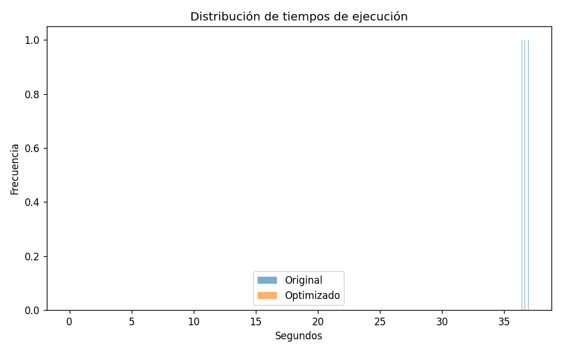
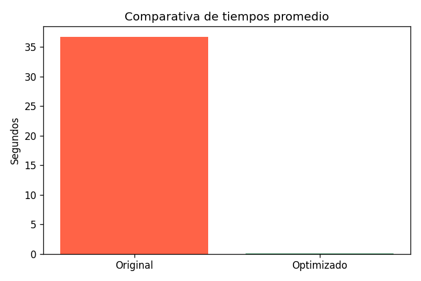

# Optimización de búsqueda de números primos

## Introducción
El código original calcula números primos entre 1 y 100 000 comprobando divisores desde 2 hasta n-1, lo que provoca complejidad O(n²) y tiempos elevados.

## Optimización aplicada
- Reducir comprobaciones hasta √n.
- Usar list comprehensions para construir listas.
- Implementar la Criba de Eratóstenes con NumPy para operaciones vectorizadas.

## ¿Qué es la Criba de Eratóstenes y cómo funciona?
La Criba de Eratóstenes es un método eficiente para encontrar todos los primos hasta un límite N:

1. Crear una lista booleana `sieve[0..N]` inicializada a True (ignorando 0 y 1).
2. Empezar en p = 2 (primer primo). Si `sieve[p]` es True, marcar como no primos todos los múltiplos de p desde p*p hasta N (p*p, p*p+p, ...).
3. Incrementar p al siguiente índice True y repetir hasta p > √N.
4. Los índices que quedan True son números primos.

Ventajas:
- Evita comprobaciones repetidas por número.
- Con operaciones vectorizadas (NumPy) las asignaciones de rangos son muy rápidas.

## Resultados
### Profiling (cProfile)
- Archivo: `profiling_optimizado.txt`
- Función dominante: `primos_optimizado_numpy`

### Gráficos
- `distribucion_tiempos.png`  
- `comparativa_tiempos.png`

Inclúyelos en la misma carpeta y referencia aquí:

  

## Conclusiones
La implementación con criba y NumPy reduce drásticamente el tiempo frente al enfoque ingenuo.

## Enlace al repositorio
Reemplaza el marcador por el enlace real a tu repo en GitHub:

Repositorio: [[ENLACE AL REPOSITORIO](https://github.com/Jhoelink/AA_04.git)]